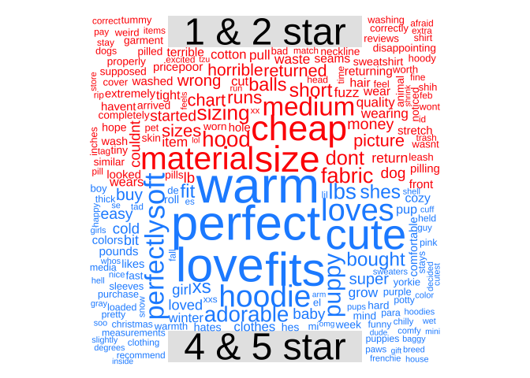

<!-- README.md is generated from README.Rmd. Please edit that file -->

# GSPtext

<!-- badges: start -->
<!-- badges: end -->

The goal of GSPtext is to quickly and easily gather and analyze reviews
from Amazon.

See the
[vignette](https://github.com/taylorgrant/GSPtext/blob/main/vignettes/GSPtext.Rmd)
for more detail about the functions used below.

## Installation

You can install the development version of GSPtext from
[GitHub](https://github.com/) with:

``` r
# install.packages("devtools")
devtools::install_github("taylorgrant/GSPtext")
```

## Basic Example

Below is a simple workflow for pulling and analyzing review data. Any
product URL from Amazon will work. Don’t worry about cleaning the tacked
on parameters. The function will clean it, determine the number of pages
to crawl, scrape the reviews, and return a tidy data frame.

If you want UGC imagery included in the reviews, specify
`get_images = "true"` as an argument and a composite will be created and
saved to your desktop.

``` r
library(GSPtext)
library(tidyverse)

# specify the url 
url <- "https://www.amazon.com/Fashion-Focus-Sweaters-Chihuahua-Clothing/dp/B07L1LHNGN/?_encoding=UTF8"

# pull reviews and images 
data <- amzn_get_reviews(url, get_images = "false") # either "true" or "false" for images
sample_n(data, 6)[,1:4] # dropping the link
```

    #>         date stars                                         headline
    #> 1 2022-01-03     5                                         Adorable
    #> 2 2022-01-09     5                                         To small
    #> 3 2022-01-30     1 Runs very small. Too small for my 18 pound puppy
    #> 4 2021-01-29     5                So cute and cozy and fits perfect
    #>                                                                                                                                                                                                                                                                                                          text
    #> 1                                                                                                                                                                                                                 Adorable. Affordable. Fits perfectly. Soft, stretchy, comfy. Arrived in less than two days!
    #> 2 The media could not be loaded.                                                                           Thought it would be a perfect size my yorkie is about 5 pounds and i got him a small but fursure needed to get a medium. But overall the sweater is really nice and good material and warm for him
    #> 3                                                                                                                                                                                                                                                               Small & not very cozy fabric for a sweatshirt
    #> 4                                                                                                                    Darling little sweater for my little 10lb dog. I love the hood on it. The neck is a tiny bit small but she loves it, she's warm and its a great fit. I ordered size med for my 10lb pup.

### Most frequent terms

Tokenize the review text and sum by star rating. We can specify how many
top terms to keep. Returns a data frame with the top n per star rating
and a bar graph, faceted by star rating.

``` r
freq_terms <- amzn_frequent_terms(sample_reviews, 15)
#> Joining, by = "word"
# can access the data 
# freq_terms$data

# plot the graph
freq_terms$graph
```


### How have ratings changed over time

Track ratings over time the product has been on Amazon. Specify whether
it’s annual or monthly, bar or line plot, and whether to include a trend
line (either “loess” or “lm”).

``` r
library(patchwork)
p1 <- amzn_ratings_over_time(sample_reviews, time = "year", viz_type = 'bar')
p2 <- amzn_ratings_over_time(sample_reviews, time = "month", viz_type = 'line', trend = "lm")
p1 + p2
#> `geom_smooth()` using formula 'y ~ x'
```


### Plotting terms by their average ratings

For every term, calculate how frequently its used in the data set,
estimate the average rating of the reviews that include that word, and
then plot it as a scatter plot. The overall average rating for the
product is represented by a dashed line, so terms above (below) that
line are more often associated with positive (negative) reviews. This is
interesting when looking for language to tie back to a product.

``` r
amzn_terms_by_rating(sample_reviews)
#> Joining, by = "word"
```


### Wordclouds

Some people want them, so there are three types. Overall across all
ratings, comparative based upon low (1 & 2 star) and high (4 and 5 star)
ratings, and comparative based upon positive or negative sentiment.
Sentiment is estimated usign the
[Bing](https://www.cs.uic.edu/~liub/FBS/sentiment-analysis.html)
lexicon.

``` r
# amzn_review_wc(sample_reviews, type = "overall") # total
# amzn_review_wc(sample_reviews, type = "comparison", comp_type = "sentiment") # by sentiment
amzn_review_wc(sample_reviews, type = "comparison", comp_type = "rating") # by hi and lo rating
#> Splitting terms by Hi (5 & 4 star) and Lo (1 & 2 star) reviews
```



### Put the terms in context

Convenience function that wraps around the `kwic()` function from the
quanteda package <https://quanteda.io/>. Dig into how specific words are
being used either via word match, regex, or phrase matching. Control the
window - the number of terms returned on either side of the key term.

``` r
# term_context(sample_reviews, pattern = "perfect", window = 8, valuetype = "glob") # standard
# term_context(sample_reviews, pattern = "perf", valuetype = "regex", window = 4) # regex
term_context(sample_reviews, pattern = "perfect fit", window = 4) # phrase
#> Keyword-in-context with 11 matches.                                                      
#>   [text92, 33:34]      if you want the | perfect fit |
#>  [text138, 12:13]  I purchased a small | Perfect fit |
#>  [text188, 80:81]       him and it's a | perfect fit |
#>    [text205, 6:7]       easy to put on | perfect fit |
#>  [text336, 12:13]     the medium was a | perfect fit |
#>    [text368, 1:2]                      | Perfect fit |
#>  [text392, 30:31]       and this was a | perfect fit |
#>    [text597, 4:5] So freaking adorable | Perfect fit |
#>    [text651, 2:3]                Loved | perfect fit |
#>    [text663, 4:5]           This was a | perfect fit |
#>    [text756, 1:2]                      | Perfect fit |
#>                            
#>                            
#>  nice soft fabric He       
#>  Very nice product and     
#>  for my tiny chiweenies    
#>  He hates wearing clothing 
#>  Although she hates clothes
#>  Although I hate that      
#>  and soft Update Love      
#>  for my Maltese            
#>  for my baby She           
#> 
```

### Track emotional valence of reviews

Using the [NRC
lexicon](https://saifmohammad.com/WebPages/NRC-Emotion-Lexicon.htm#:~:text=NRC%20Word%2DEmotion%20Association%20Lexicon,were%20manually%20done%20by%20crowdsourcing.)
to match terms to emotions. What emotions are more prevalent with 5 star
reviews compared to 1 star?

``` r
library(patchwork)
emotion <- text_to_emotion(sample_reviews)
#> Joining, by = "word"
#> Joining, by = "word"
# emotion$data
p1 <-emotion$graph1
p2 <- emotion$graph2
p1 / p2
```


### Estimate the sentiment of the reviews

Estimating sentiment of each review using the
[sentimentr](https://github.com/trinker/sentimentr) package from Rinker.
Sentiment is calculated at the sentence level and the “review
senetiment” is then the weighted average across all sentences comprising
that review. The package accounts for “valence shifters” by adding
additional weights for terms that can negate or amplify sentiment.

The returned data is the full review data frame with sentiment data
added - word count for each review, standard deviation for the sentiment
estimate for each review (only if the review includes more than 1
sentence), and the estimated sentiment for each review.

``` r
sentiment <- amzn_review_sentiment(sample_reviews)
#> Estimating the sentiment for each review. This will just take a minute...
sentiment$graph
```


### Co-occurrence networks

Visualize which terms most frequently co-occur within reviews. These are
split out by star rating, the user must specify which star rating to
plot and the floor number of co-occurrences that must be present.

``` r
# term co-occurrence 
# amzn_cooccur_net(sample_reviews, star = 1, nn = 4)
amzn_cooccur_net(sample_reviews, star = 5, nn = 15)
#> With a floor of 15 co-occurrences, the graph is based on 58 word pairs...
```


